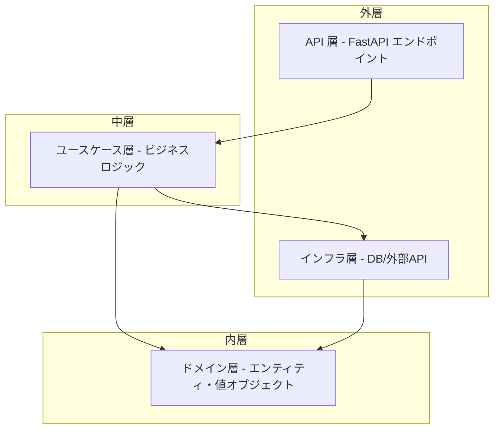
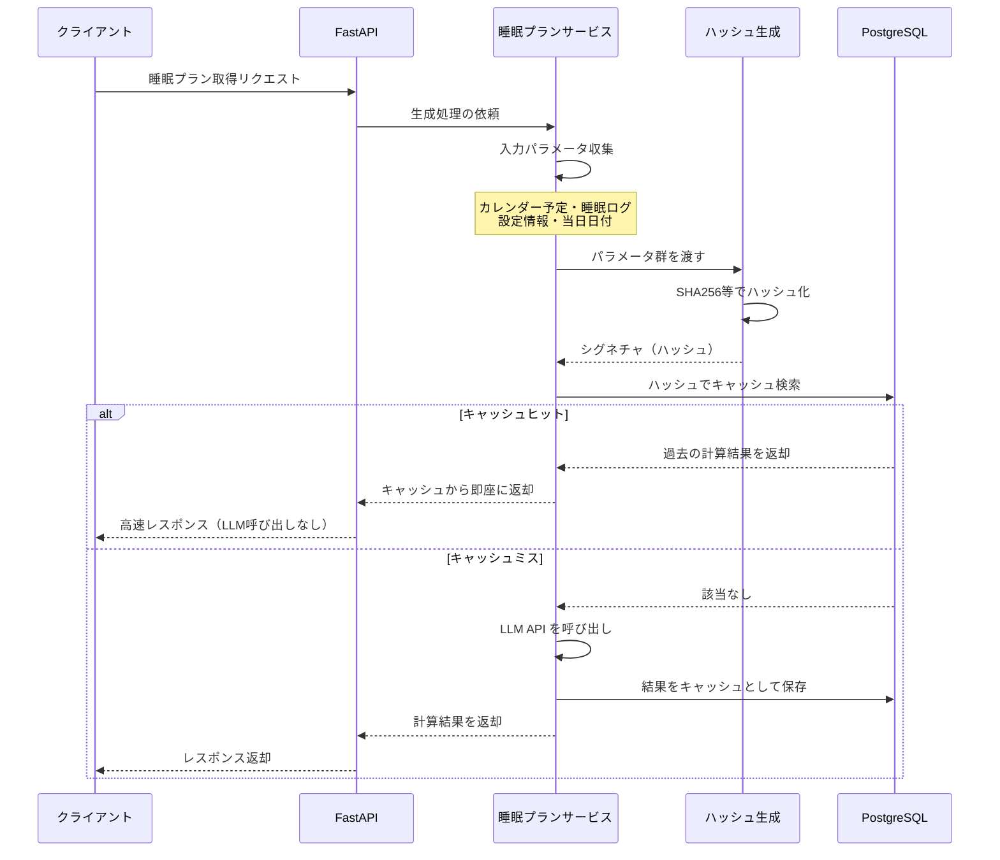
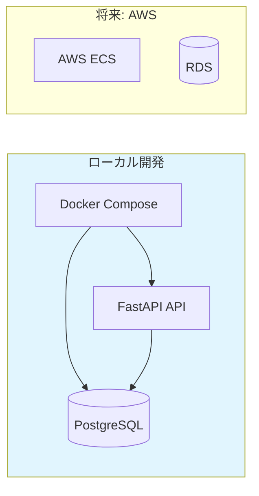
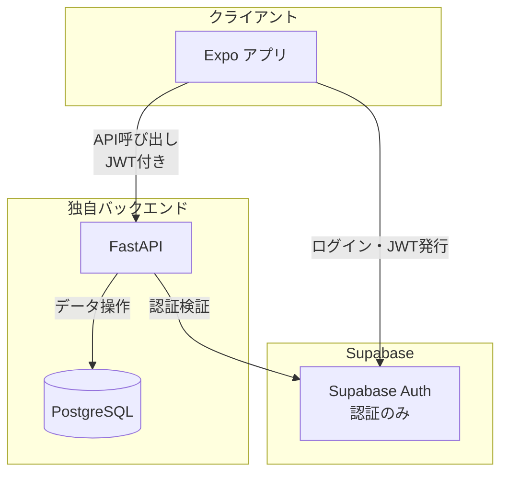
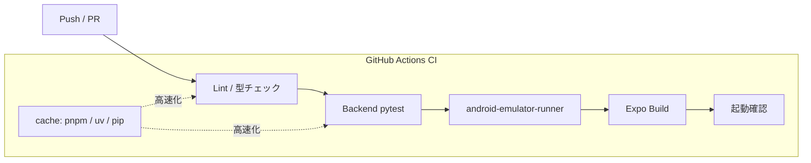

# 睡眠プランニングアプリ 寝るプラ

## チーム名

チーム22 「新規性はありますか？」

## 背景・課題・解決されること

### 背景
現代人（特に大学生）は予定が詰まりやすく、業務や私的な用事が深夜まで及ぶことも珍しくない。そのため、毎日決まった時間に就寝、起床することは難しい。結果として、寝坊や、寝たはずなのに疲れている、、、という起床時の疲労感などの問題がある。

### 課題

既存の睡眠支援アプリケーションには、以下の課題がある。

- 固定化されたスケジュールの限界
決まった時間に起床を促すだけのシステムでは、日々の変動が激しい現実のスケジュールに適応しきれず、継続的な利用が困難になるケースが多い。

- 「寝溜め」の限界と生活リズムの崩壊
睡眠時間が不足する日が生じた際、そのしわ寄せを前後の日程でいかに補填するかの視点が欠如している。休日の過度な「寝溜め」による調整には生理的な限界があり、かえって生活リズムを大きく乱す要因となる。

- 時間確保だけでは解決しない「環境」の問題
睡眠は時間の確保だけでなく、質の向上が不可欠である。周囲の光や騒音、就寝前の過度のスマートフォン操作といった不適切な就寝環境は、スムーズな入眠を妨げ、疲労回復効果を著しく低下させる。
### 解決

提案・解決策 (Solution)
本アプリケーションは、多忙な現代人に「最適な睡眠」を提供することを目的とした、実践的な睡眠支援ツールである。ユーザーのスケジュールと物理的な生活環境の双方からアプローチし、以下の4つのコア機能によって睡眠の最適化を図る。

1. 睡眠プラン：1週間を見据えたトータル睡眠コントロール
機能概要: Googleカレンダーと同期し、ユーザーの予定（移動時間や予定の重要度を含む）をAIが自動取得して睡眠計画を生成する。

    - システムの強み: 1日単位ではなく「1週間程度」を単位として俯瞰的にプランニングを行う。睡眠が削られる日があっても、寝溜めの限界を考慮しつつ前後の日程で最適にカバーし、生活リズムの崩壊を防ぐ、現実的かつ最も効果的な睡眠プランを提案する。

2. 睡眠モニター：スムーズな入眠のための環境最適化
機能概要: デバイスのセンサーを用いて周囲の「光」と「音」を常時モニタリング・視覚化し、同時に就寝前の過度なスマートフォン操作を検知して警告を発する。

    - システムの強み: 睡眠を妨げる物理的要因をシステム側で検知・排除を促すことで、スムーズに入眠できる最適な環境づくりを強力にサポートする。

3. モーニングアラーム：朝の目覚めを最高にする確実な起床
機能概要: 予定の開始時刻と準備に必要な時間から逆算し、適切な起床時間に行動を開始できるよう支援する。

    - システムの強み: 予定の切迫状況（重要度）に応じてアラームの強度を2段階で動的に変更する。さらに、起床直後に写真撮影を要求する「モーニングミッション」を搭載し、アラーム停止後の二度寝を物理的に防止して確実な覚醒を実現する。

4. 睡眠ログ：主観的な「睡眠体験」の記録と学習
機能概要: 起床直後に「目覚めの体調や気分」を入力させ、主観的な睡眠の質を記録する。

    - システムの強み: 単なる睡眠時間のトラッキングにとどまらず、ユーザーの「体感」をデータ化する。取得したログデータはAIによる次回の睡眠計画生成にフィードバックされ、継続的な利用により個人の体質や生活リズムに適応したパーソナライズが可能となる。
## プロダクト説明

SleepSupportApp は、AI 駆動の総合睡眠支援 Android アプリケーションです。

### 主な機能

- **睡眠環境モニタリング**: スマートフォンのセンサーで寝室の照度・騒音レベル、寝る直前のスマホの利用をリアルタイム計測し、睡眠に適した環境かどうかをスコアリング
- **AI 睡眠プラン生成**: ユーザーのスケジュールや睡眠履歴に基づき、LLM が最適な週間睡眠プランを自動生成
- **睡眠ログ・分析**: 日々の睡眠スコアや気分を記録し、週間トレンドをグラフで可視化
- **ミッション付きアラーム**: 段階的アラーム（やさしい → 厳しい）と、カメラを使ったターゲット撮影チャレンジによる確実な起床サポート
- **睡眠スケジュール管理**: 起床時間・睡眠時間の設定と、それに基づいたアドバイスの提供

## 操作説明・デモ動画

[デモ動画はこちら](https://youtube.com/shorts/rWXppu_L6qY)

### 基本的な使い方

1. アプリを起動し、アカウントを作成・ログイン
2. 設定画面で起床時間・希望睡眠時間を設定
3. ホーム画面で今日の睡眠プランを確認
4. 就寝前に睡眠モニターを起動し、寝室環境をチェック
5. アラームが設定された時間に段階的に鳴動し、必要に応じてミッションをクリアして起床
6. 起床後に気分を記録し、睡眠ログで自分の睡眠傾向を振り返り

## 注力したポイント

### アイデア面

- スマートフォンの内蔵センサー（照度・マイク）を活用することで、専用デバイスなしに睡眠環境を計測できるようにした点
- カレンダーを利用した、LLM による個人最適化された睡眠プラン生成で、画一的なアドバイスではなくユーザーに寄り添った提案を実現
- カメラを使ったミッション型アラームにより、ゲーミフィケーション要素で楽しく確実に起床できる仕組み

### デザイン面

- 就寝前の利用を考慮し、目に優しい落ち着いた配色とシンプルな UI を採用
- 睡眠フェーズ（準備 → 入眠前 → 睡眠中）に応じた画面遷移で、直感的な操作体験を実現
- 睡眠スコアやトレンドをグラフで可視化し、改善の実感を得やすいデザイン

### その他

- バックグラウンドでのセンサー計測に対応し、画面オフ時でもモニタリングを継続
- 睡眠プランのキャッシュ機構を実装し、LLM API への不要なリクエストを削減
- Onion Architecture（バックエンド）と FSD Lite（フロントエンド）による保守性の高いコード設計

## 使用技術

### フロントエンド

| カテゴリ             | 技術                               | バージョン      |
| -------------------- | ---------------------------------- | --------------- |
| フレームワーク       | React Native (Expo)                | SDK 54          |
| 言語                 | TypeScript                         | strict mode     |
| ルーティング         | Expo Router                        | v6 (file-based) |
| 状態管理             | Zustand                            | v5              |
| パッケージマネージャ | pnpm                               | 9.x             |
| 認証                 | Supabase Auth                      | -               |
| センサー             | expo-sensors, expo-camera, expo-av | -               |
| 通知                 | expo-notifications                 | -               |
| バックグラウンド処理 | react-native-background-actions    | -               |

### バックエンド

| カテゴリ             | 技術                   | バージョン |
| -------------------- | ---------------------- | ---------- |
| フレームワーク       | FastAPI                | v0.109+    |
| 言語                 | Python                 | 3.11+      |
| ORM                  | SQLAlchemy 2 (async)   | v2.0+      |
| データベース         | PostgreSQL             | asyncpg    |
| マイグレーション     | Alembic                | v1.13+     |
| パッケージマネージャ | uv                     | -          |
| LLM 連携             | OpenRouter API (httpx) | -          |
| 認証                 | Supabase JWT + PyJWT   | -          |

### インフラ・DevOps

| カテゴリ     | 技術                         |
| ------------ | ---------------------------- |
| コンテナ     | Docker / Docker Compose      |
| 認証基盤     | Supabase (Cloud)             |
| タスク自動化 | Taskfile (go-task)           |
| コード品質   | ESLint, Prettier, Ruff, MyPy |
| 型チェック   | TypeScript (tsc), MyPy       |

## 🚀 バックエンド・インフラ・アーキテクチャ

本プロジェクトでは、AI 駆動開発のメリットを最大化しつつ、将来的な拡張性（AWS ECS 等へのデプロイ）を見据え、堅牢で開発体験（DX）の高いアーキテクチャを設計・構築しました。

### 1. アーキテクチャ設計

#### オニオンアーキテクチャの採用

AI 駆動で開発を進めるにあたり、LLM が事前学習で深く理解している標準的なデザインパターン「オニオンアーキテクチャ」を採用しました。これにより、AI によるコード生成の品質が安定するだけでなく、コードの関心事が明確に分離され、修正・テストのしやすい保守性の高いバックエンドを実現しています。

### 2. パフォーマンスとコストの最適化

#### LLM リクエストのハッシュ化による高度なキャッシュ機構

高価で時間のかかる LLM API への不要なリクエストを抑えるため、「カレンダーの予定」「睡眠ログ」「設定情報」「当日の日付」などの入力パラメータ群から一意のシグネチャ（ハッシュ）を生成しています。このハッシュを用いて過去の計算結果を DB 内で検索・判定することで、同一条件であればキャッシュを即座に返却し、UX の劇的な向上（高速なレスポンス）と API コストの最小化を両立させています。

### 3. インフラストラクチャとセキュリティ

#### Docker 完結の独立したインフラスタック

ハッカソンにおける初期開発スピードを重視しつつ、将来的には AWS（ECS など）へのデプロイを見据え、ローカルの `docker-compose` で完全に動作するインフラ環境を構築しました。

#### BaaS への過度な依存を排除しセキュリティを担保

Firebase などの BaaS への過度なロックインを避け、Supabase は「認証基盤」としてのみ活用しています。Row Level Security (RLS) 単体に依存したデータ管理はセキュリティや柔軟性の面でリスクになり得ると判断し、データの保存や複雑なビジネスロジックはすべて独自のバックエンド（FastAPI + PostgreSQL）を通過させる堅牢な設計としています。

### 4. 圧倒的な開発体験（DX）の向上

#### Taskfile による「ワンクリック環境構築」とネットワーク自動解決

ネイティブアプリ開発において最も煩雑な「スマホ実機やエミュレーターから、ローカル Docker 内の API への IP アドレス解決・ポートフォワーディング」の課題を完全に自動化しました。`task dev-up` や `task dev-up-emulator` コマンドを実行するだけで、以下のフローが一括で処理されます。

この仕組みにより、新規参画メンバーでも迷うことなく、一瞬で開発に集中できる極めて高い開発体験を実現しました。

### 5. 高速・堅牢な CI/CD パイプライン

#### 徹底したキャッシュ戦略による実行時間の短縮

GitHub Actions での CI 実行時間を短縮するため、フロントエンドでは `pnpm store` のキャッシュを利用し、バックエンドでは `astral-sh/setup-uv` を用いた pip キャッシュを導入しています。また、Dockerfile でも `uv sync --no-install-project` を活用し、依存関係のレイヤーキャッシュを最大限に効かせる工夫を施しています。

#### エミュレーターを用いた統合テストの完全自動化

静的解析やバックエンドのテスト（pytest）に加え、`android-emulator-runner` を使用して CI 上でネイティブアプリのエミュレーター環境を再現しています。ビルドから起動確認までを自動化することで、「とりあえず Push・PR を送り、バグの確認はほぼ GitHub 上で完結させる」という高速でアジャイルな開発サイクルを実現しています。

## チームメンバー

| メンバー        | 担当領域                                 |
| --------------- | ---------------------------------------- |
| @taitaitai58    | バックエンド・インフラ・アーキテクチャ        |
| @yuito393439    | フロントエンド (UI/UXデザイン・画面実装) |
| @Taku-taku-Taku | センサー連携                             |
| @You8102        | バックグラウンド処理                     |
| @taniharu1214   | アラーム・カレンダー連携                 |

<!--
markdownの記法はこちらを参照してください！
https://docs.github.com/ja/get-started/writing-on-github/getting-started-with-writing-and-formatting-on-github/basic-writing-and-formatting-syntax
-->
