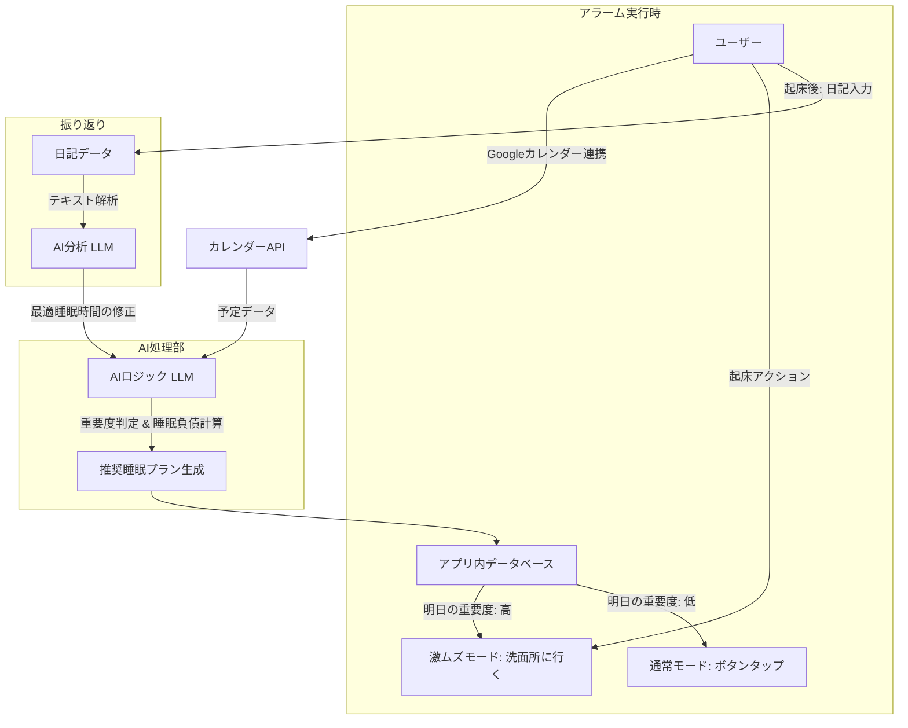
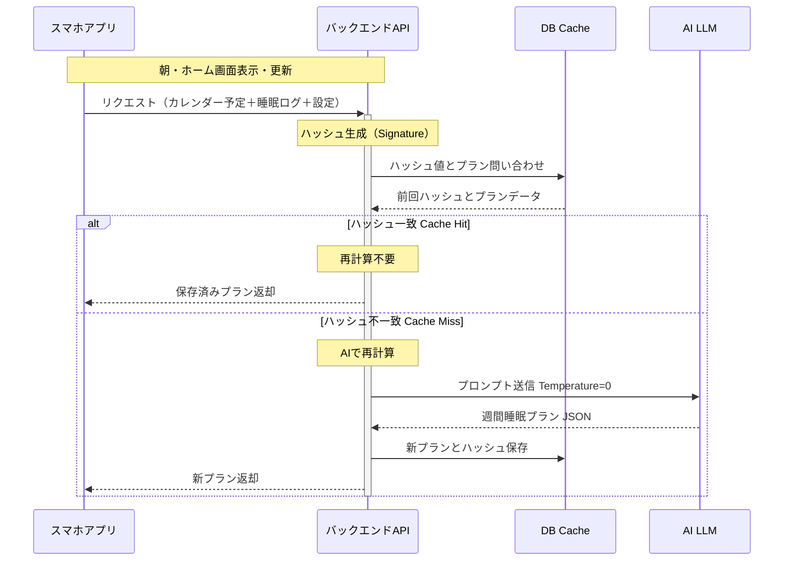

# SleepSupportApp アーキテクチャ図

```mermaid
graph TD
    User[ユーザー] -->|Googleカレンダー連携| CalendarAPI[カレンダーAPI]
    CalendarAPI -->|予定データ| AI_Planner[AIロジック LLM]
    
    subgraph AI処理部
    AI_Planner -->|重要度判定 & 睡眠負債計算| SchedulePlan[推奨睡眠プラン生成]
    end
    
    SchedulePlan --> AppDB[アプリ内データベース]
    
    subgraph アラーム実行時
    AppDB -->|明日の重要度: 高| AlarmHard[激ムズモード: 洗面所に行く]
    AppDB -->|明日の重要度: 低| AlarmEasy[通常モード: ボタンタップ]
    User -->|起床アクション| AlarmHard
    end
    
    subgraph 振り返り
    User -->|起床後: 日記入力| Diary[日記データ]
    Diary -->|テキスト解析| AI_Analyst[AI分析 LLM]
    AI_Analyst -->|最適睡眠時間の修正| AI_Planner
    end
```

## 朝のホーム画面表示フロー（キャッシュ付き）

```mermaid
sequenceDiagram
    participant App as スマホアプリ
    participant Server as バックエンドAPI
    participant DB as DB Cache
    participant AI as AI LLM

    Note over App,Server: 朝・ホーム画面表示・更新
    App->>+Server: リクエスト（カレンダー予定＋睡眠ログ＋設定）

    Note over Server: ハッシュ生成（Signature）

    Server->>DB: ハッシュ値とプラン問い合わせ
    DB-->>Server: 前回ハッシュとプランデータ

    alt ハッシュ一致 Cache Hit
        Note over Server: 再計算不要
        Server-->>App: 保存済みプラン返却
    else ハッシュ不一致 Cache Miss
        Note over Server: AIで再計算
        Server->>AI: プロンプト送信 Temperature=0
        AI-->>Server: 週間睡眠プラン JSON
        Server->>DB: 新プランとハッシュ保存
        Server-->>App: 新プラン返却
    end

    deactivate Server
```
