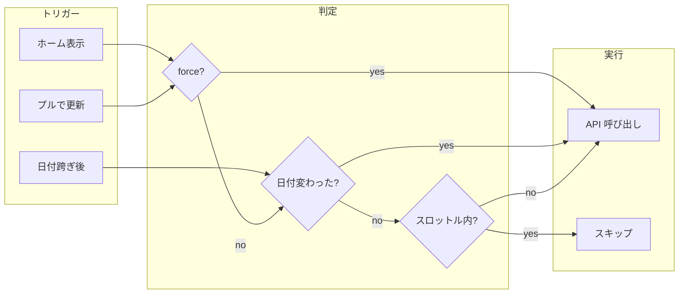
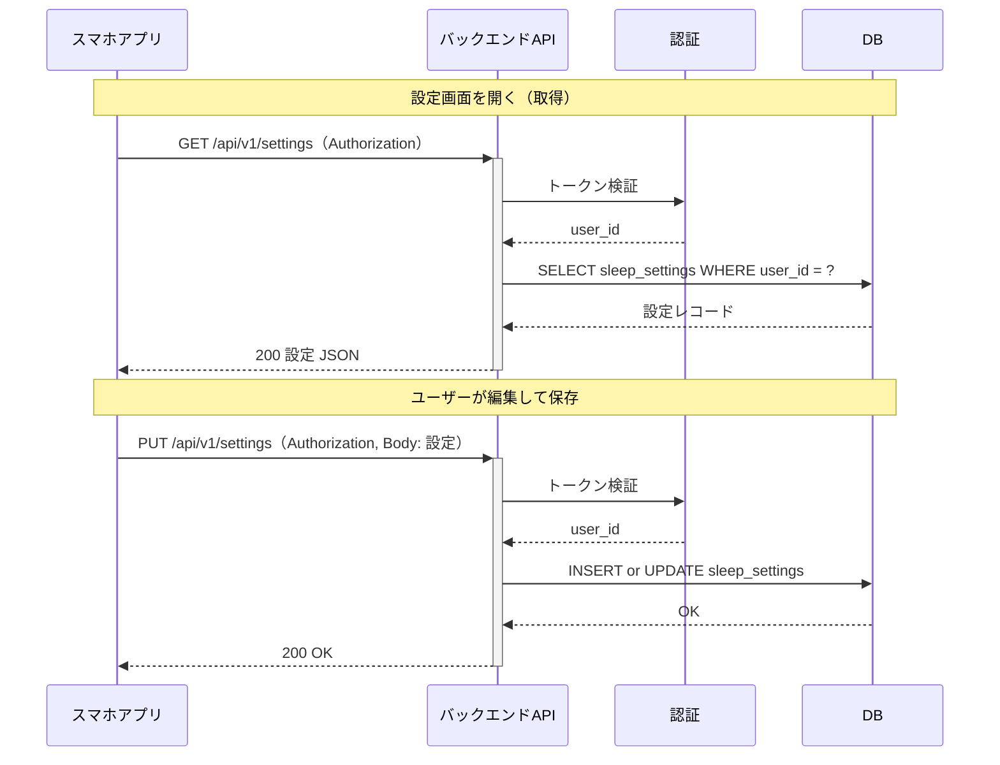
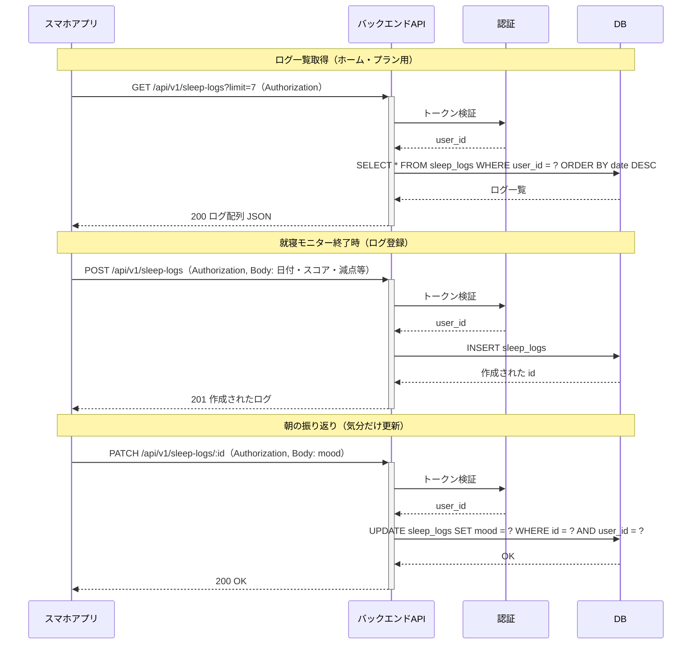
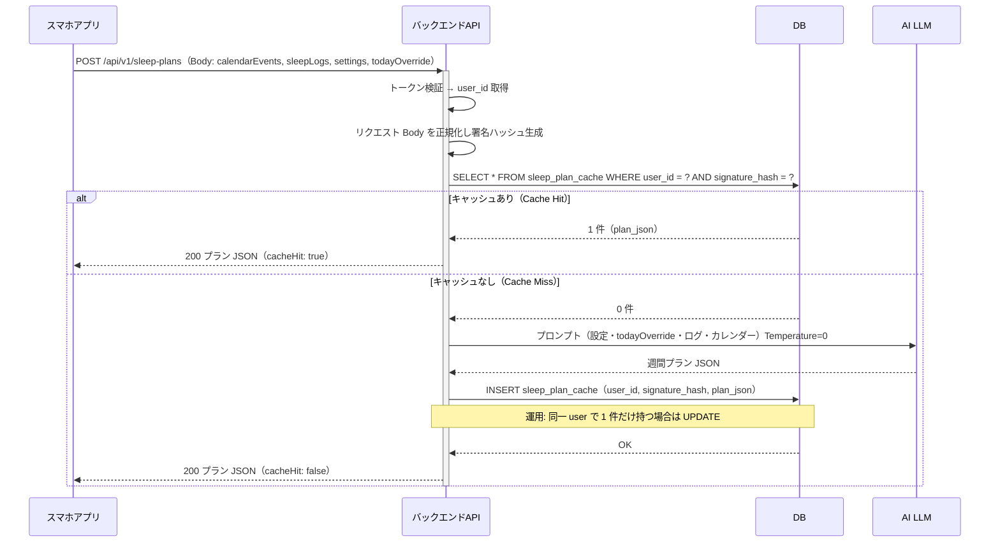
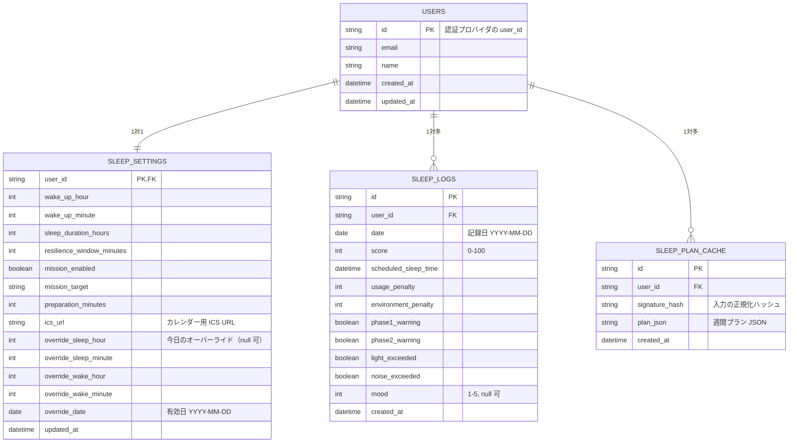

# バックエンド設計書

睡眠サポートアプリのバックエンドをマルチユーザー・認証必須で設計し、状態管理をバックエンドで一元化する方針をまとめる。

---

## 1. 方針

| 項目 | 方針 |
|------|------|
| **ユーザー** | マルチユーザー想定 |
| **認証** | 必須。未認証はプラン・設定・ログの取得・更新不可 |
| **状態管理** | 基本的にすべてバックエンドで保持。フロントは取得・更新の窓口 |
| **今日のオーバーライド** | リクエストに含め、AIプラン生成の入力とする。署名（ハッシュ）にも含める |
| **設定の編集** | **必要な各種設定はフロントの設定画面で編集可能とする**。編集結果はバックエンドの設定 API で保存し、再起動・他デバイスでも反映される |

---

## 2. 認証

- すべての API は**認証必須**とする。
- 認証方式は Supabase Auth 等を想定（トークンをヘッダーで送り、バックエンドで検証して `user_id` を確定）。
- レスポンスのプラン・設定・ログは**必ずその user_id に紐づけて**保存・取得する。

（実装詳細は別ドキュメントまたは phase で定義。）

---

## 3. 状態の保存先（バックエンドで保持するもの）

フロントの以下は、バックエンドをソースオブトゥルースとする。

| 状態 | 説明 | バックエンドでの扱い |
|------|------|----------------------|
| **ユーザー** | id, email, name 等 | 認証プロバイダ連携で取得。必要なら users テーブルで補足 |
| **睡眠設定** | 起床時刻・睡眠時間・レジリエンス・ミッション・準備時間・**ICS URL** 等 | 設定 API で保存・取得。ユーザー単位 |
| **今日のオーバーライド** | 今日だけの就寝・起床時刻の変更 | 設定に含めるか、プランリクエスト時に毎回送る。いずれもハッシュに含める |
| **睡眠ログ** | 日付・スコア・就寝予定時刻・気分 等 | ログ API で保存・取得。ユーザー単位 |
| **週間睡眠プラン** | AI 生成プラン＋キャッシュ | キャッシュテーブル（user_id + signature_hash）で保持。後述 |
| **カレンダー参照元** | 公開 ICS の URL（icsUrl） | 設定の一部としてバックエンドに保存。**予定データ自体はバックエンドに保存しない**（後述） |

カレンダー**予定の取得**は**クライアント**が行う。クライアントは設定で保持する **ICS URL** を使って ICS を取得・解析し、得た予定一覧をプラン取得 API のリクエスト body（calendarEvents）で送る。

### 3.1 設定の編集 UI（フロント）

必要な各種設定は**フロントの設定画面（および該当する画面）で編集できる**ようにする。ユーザーが変更した内容はバックエンドの設定 API（GET / PUT 等）で保存・取得し、アプリ再起動や他デバイスでも同じ値が使われる。

| 設定項目 | 編集場所（想定） | 備考 |
|----------|------------------|------|
| 起床時刻・睡眠時間 | 設定画面 | 就寝時刻は自動計算 |
| ICS URL（カレンダー） | 設定画面 | 公開 ICS の URL を 1 本指定 |
| レジリエンスウィンドウ（分） | 設定画面 | アラーム Phase1 の長さ |
| ミッション（有効/無効・対象） | 設定画面 | 起床ミッション（例: 洗面所） |
| 起床〜出発までの所要時間（分） | 設定画面 | スケジュールアドバイス用 |
| 今日のオーバーライド（就寝・起床） | ホーム画面など | 今日だけの一時変更。日付で自動リセット |

- 設定画面の初期表示時は **GET 設定 API** でバックエンドから取得した値でフォームを埋める。
- ユーザーが保存したら **PUT（または PATCH）設定 API** でバックエンドに送る。成功後にローカル状態（Zustand 等）を更新する。

---

## 4. 朝・ホーム画面フロー（キャッシュ付き）

### 4.0 プラン生成のタイミング

週間睡眠プランは**オンデマンド**で生成する。バッチや定期実行は行わず、「アプリがプランを必要としたとき」に API を呼び、その時点の入力（カレンダー・ログ・設定・todayOverride）でサーバーが Cache Hit または新規生成する。

#### いつリクエストするか（トリガー）

| トリガー | 説明 | 備考 |
|----------|------|------|
| **ホーム画面を表示したとき** | ホームがマウントされたとき（初回表示・タブ切替で戻ったとき）に 1 回、プラン取得を試みる。 | メインのトリガー。 |
| **日付が変わったあとでホームを表示したとき** | アプリ利用中に 0 時をまたいだ、または翌日にアプリを開いた場合。「今日」のプランが変わるので再取得する。 | 下記「今日」の扱いと連動。 |
| **プルで更新** | ユーザーがホームでプルダウンして更新したとき。**force=true** でキャッシュを無視して再計算させる。 | 手動で最新化したいとき。 |
| **設定を保存したあと** | 設定画面で保存したあとホームに戻ったとき。入力が変わるので次回のプラン取得で Cache Miss になりうる。 | 必要ならホーム復帰時に再取得（force なしでよい）。 |

#### 「今日」の扱いと日付の境界

- **「今日」**: 端末のローカル日付（`YYYY-MM-DD`）で判定する。プランの `dailyPlans` のうち `date === 今日` の 1 件を「今日のプラン」として表示する。
- **日付が変わったら**: 前回取得から**日付が変わっていたら**、クライアントは「前回取得は別の日」とみなし、**スロットル（下記）を無視して再取得してよい**。日付が変わると sleepLogs（直近7日）や todayOverride の date が変わりうるため、サーバー側のハッシュも変わり、自然に Cache Miss になるか、同じハッシュなら Cache Hit のまま。
- **日付の切り替えタイミング**: 0:00（ midnight ）で切り替える実装でよい。タイムゾーンは端末のローカルに従う。

#### クライアント側の再取得ポリシー

- **スロットル（同一日・短時間の連打防止）**: 同じ「日」（ローカル日付）のうち、**最後に取得成功してから N 分以内**は、force が false なら再リクエストしない。例: N = 5 分。これにより、ホームを何度も開閉しても API が連打されない。
- **日付跨ぎ**: **前回取得成功時の日付**と**現在の日付**が異なれば、スロットルを適用せずに再取得する（「今日のプラン」を最新にするため）。
- **force=true**: プルで更新などで明示的に指定されたときは、スロットル・日付を問わず必ず API を呼ぶ。サーバーには `force=true` を渡し、キャッシュを無視して再計算させる。



#### サーバー側のキャッシュ

- キャッシュは**入力ハッシュ**で判定する。有効期限（TTL）は**設けない**想定とする。同じ入力なら常に同じプランを返す。
- 必要に応じて、将来「キャッシュ作成から 24 時間経過したら無効」などの TTL を追加してもよい。その場合は設計書を更新する。

#### まとめ（いつ「生成」されるか）

- **生成が起こるタイミング**: クライアントが **POST /api/v1/sleep-plans** を呼んだとき、かつサーバー側で Cache Miss のとき（入力ハッシュに一致するキャッシュが無いとき）に、AI で週間プランが**新規生成**される。
- つまり「プランを生成するタイミング」＝**ユーザーがホームを開く（またはプルで更新する）タイミング**で、かつそのときの入力が前回と変わっている場合（または force でキャッシュ無視した場合）に、サーバーが新規生成する。

#### フロント実装の目安

- **lastFetchedAt** に加え、**lastFetchedDate**（取得成功時の `YYYY-MM-DD`）を保持する。
- **fetchPlan(force?: boolean)** の先頭で:  
  `if (force) { 必ず API 呼び出し }`  
  `else if (lastFetchedDate !== 今日の日付) { スロットル無視して API 呼び出し }`  
  `else if (Date.now() - lastFetchedAt < N分) { スキップ }`  
  `else { API 呼び出し }`
- 取得成功時に `lastFetchedAt = Date.now()` と `lastFetchedDate = 今日の日付` を更新する。

---

シークエンスは以下を前提とする。

1. アプリは**認証済み**で、カレンダー予定・睡眠ログ・設定・**todayOverride** をまとめて送る。
2. バックエンドはこれらから**署名（ハッシュ）**を生成する。**todayOverride もハッシュに含める。**
3. 同じ user_id で同じハッシュのキャッシュがあれば Cache Hit → 保存済みプランを返す（`cacheHit: true`）。
4. なければ Cache Miss → AI で週間プランを再計算（**todayOverride を考慮したプラン**）→ キャッシュに保存 → 返す（`cacheHit: false`）。

```
sequenceDiagram
    participant App as スマホアプリ
    participant Server as バックエンドAPI
    participant DB as DB Cache
    participant AI as AI LLM

    Note over App,Server: 朝・ホーム画面表示・更新（認証済み）
    App->>+Server: POST /api/v1/sleep-plans（カレンダー＋睡眠ログ＋設定＋todayOverride）

    Note over Server: 署名ハッシュ生成（設定＋todayOverride＋ログ＋カレンダー）

    Server->>DB: ハッシュとプラン問い合わせ（user_id 付き）
    DB-->>Server: 前回ハッシュとプランデータ

    alt ハッシュ一致 Cache Hit
        Note over Server: 再計算不要
        Server-->>App: 保存済みプラン返却（cacheHit: true）
    else ハッシュ不一致 Cache Miss
        Note over Server: AIで再計算（todayOverride を考慮）
        Server->>AI: プロンプト送信 Temperature=0
        AI-->>Server: 週間睡眠プラン JSON
        Server->>DB: 新プランとハッシュ保存（user_id 紐づけ）
        Server-->>App: 新プラン返却（cacheHit: false）
    end

    deactivate Server
```

---

### 4.1 設定の取得・保存

設定画面の表示時と保存時の流れ。



### 4.2 睡眠ログの取得・保存

ログ一覧の取得と、就寝終了時のログ登録・朝の気分更新。



### 4.3 プラン取得（内部での DB 参照）

プラン取得時に、バックエンドがキャッシュテーブルと AI をどう使うかを示す。



---

## 5. 署名（ハッシュ）の対象

キャッシュヒット判定に使う署名は、**次の入力全体**を正規化した文字列から生成する。

- **カレンダー予定**（title, start, end, allDay 等）
- **睡眠ログ**（直近分。date, score, scheduledSleepTime 等）
- **設定**（wakeUpTime, sleepDurationHours 等、フロントの `SleepSettingsSummary` 相当）
- **今日のオーバーライド（todayOverride）**  
  - 例: `{ date, sleepHour, sleepMinute, wakeHour, wakeMinute }` または「今日の有効就寝・起床」を表す一意な表現  
  - 含めないと、今日だけ時刻を変えた場合に古いプランが返ってしまうため、**必ず含める。**

実装上の注意:

- キーをソートするなどして**順序に依存しない**シリアライズにする。
- 日付・時刻は **ISO 8601** などフォーマットを固定する。
- 同じ論理内容なら同じハッシュになるよう、省略可能なフィールドの扱いを統一する（例: `todayOverride` が null のときは `"null"` やキーごと省略することを仕様で決める）。

---

## 5.1 カレンダー（ICS）仕様

カレンダーは**公開 ICS（iCalendar）の URL** を 1 本だけ参照する方式とする。Google Calendar の「予定を共有」で取得できる「秘密アドレス」の URL を想定する。

### クライアント側の役割

| 項目 | 内容 |
|------|------|
| **ICS URL の保持** | 睡眠設定の一部（`icsUrl`）として扱う。バックエンドの設定 API で保存・取得するため、複数デバイスで共通になる。 |
| **予定の取得** | プラン取得やスケジュールアドバイスなどの直前で、`icsUrl` を使って ICS を **HTTP GET** で取得する。 |
| **ICS の解析** | クライアント側で VEVENT をパースし、`CalendarEvent` の配列に変換する。DTSTART / DTEND / SUMMARY / DESCRIPTION / UID 等を解釈。終日（YYYYMMDD）・日時（YYYYMMDDTHHMMSS 等）の両方に対応。 |
| **プラン API への送付** | 取得した予定を `CalendarEventSummary` 形式（title, start, end, allDay）にし、**POST /api/v1/sleep-plans** の body の `calendarEvents` に含める。 |

### バックエンド側の役割

| 項目 | 内容 |
|------|------|
| **ICS URL の保存** | 睡眠設定テーブルに `ics_url`（または同等）カラムを持ち、GET/PUT 設定 API で返す・受け取る。 |
| **予定の取得・保存** | **行わない**。バックエンドは ICS に HTTP アクセスせず、予定データを DB に保存しない。 |
| **プラン計算** | リクエスト body の `calendarEvents` をそのまま署名ハッシュと AI プロンプトの入力に使う。 |

### データ形式の対応

- クライアントの `CalendarEvent`（googleCalendar）: `start` / `end` は `Date`。API 送付時は **ISO 8601 文字列**（`CalendarEventSummary.start` / `.end`）に変換する。
- 署名ハッシュでは、この文字列化した予定一覧を正規化して含める。

### カレンダー書き込み（createEvent / updateEvent / deleteEvent）

- 現状フロントはスタブのまま。**バックエンドの本設計の対象外**とする。  
- 将来、アプリから「睡眠時間ブロック」などをカレンダーに書き込む場合は、Google Calendar API（OAuth）をクライアントで行うか、バックエンドでプロキシするかは別途検討する。

---

## 6. リクエスト・レスポンス型（プラン API）

### 6.1 プラン取得リクエスト（拡張）

フロントの `SleepPlanRequest` を拡張し、**todayOverride を追加**する。

| フィールド | 型 | 説明 |
|------------|-----|------|
| calendarEvents | 配列 | カレンダー予定の要約（title, start, end, allDay） |
| sleepLogs | 配列 | 睡眠ログ要約（date, score, scheduledSleepTime） |
| settings | オブジェクト | 起床時刻（HH:mm）、希望睡眠時間（時間） |
| **todayOverride** | オブジェクト \| null | 今日だけの就寝・起床オーバーライド。無い場合は null |

`todayOverride` の例:

```json
{
  "date": "2026-02-20",
  "sleepHour": 23,
  "sleepMinute": 30,
  "wakeHour": 7,
  "wakeMinute": 0
}
```

- バックエンドはこの todayOverride を**プロンプトに含めて** AI に渡し、「今日は 23:30 就寝・7:00 起床」のように反映した週間プランを生成する。
- 同時に、この todayOverride も**署名ハッシュの入力**に含める。

### 6.2 プラン取得レスポンス

既存の `WeeklySleepPlan` をそのまま利用する。

- id, dailyPlans, createdAt, **cacheHit**（Cache Hit なら true、Miss なら false）

### 6.3 エンドポイント

- **POST /api/v1/sleep-plans**  
  - 認証必須。  
  - Body: 上記リクエスト（calendarEvents, sleepLogs, settings, todayOverride）。  
  - クエリに `force=true` を付けた場合はキャッシュを無視して再計算する（フロントの `fetchPlan(true)` 用）。

---

## 7. データベース（概要）

### 7.1 ユーザー・認証

- 認証は外部プロバイダ（Supabase Auth 等）に委譲。
- 必要に応じて **users** テーブルで user_id / email 等を保持。

### 7.2 睡眠設定

- **sleep_settings**（または同等）: user_id, 起床時刻・睡眠時間・レジリエンス・ミッション・準備時間・**ics_url**（カレンダー用 ICS URL） 等、updated_at。
- 今日のオーバーライドは「設定の一部」として 1 レコードで持つか、またはプランリクエストのたびに body で送り、設定テーブルには「現在のオーバーライド」だけ持つかは実装で決定。いずれにせよ**ハッシュには todayOverride を含める**。

### 7.3 睡眠ログ

- **sleep_logs**: user_id, date, score, scheduled_sleep_time, mood, その他フロントの SleepLogEntry に相当する項目、created_at。
- 取得 API で「直近 N 日」を返し、フロントはプランリクエスト時にその内容を body に含めてもよい。またはバックエンドが user_id でログを取得してプラン計算に使う形でもよい（その場合は「プランリクエストにログを入れず、バックエンドで取得」と仕様化する）。

### 7.4 プランキャッシュ

- **sleep_plan_cache**（または phase0 の SleepPlanCache）:
  - user_id
  - signature_hash（上記「署名の対象」で生成したハッシュ）
  - plan_json（週間プラン JSON）
  - created_at
- 1 user につき「直近の 1 件」を返す運用なら、同一 user_id で signature_hash が一致する行があれば Cache Hit。なければ Cache Miss として AI を呼び、新規に保存（または同一 user で UPDATE）。

### 7.5 ER 図



- **USERS**: 認証で確定したユーザー。Supabase Auth 等と連携する場合は `auth.users` を参照し、必要ならアプリ用に `users` で補足する。
- **SLEEP_SETTINGS**: 1 ユーザー 1 行。今日のオーバーライドを同じテーブルの nullable カラムで持つ想定（別テーブルでも可）。
- **SLEEP_LOGS**: 1 ユーザーあたり複数行（日付ごと・記録ごと）。
- **SLEEP_PLAN_CACHE**: 1 ユーザーあたり複数行（ハッシュごと）。運用で「直近 1 件だけ使う」場合は同一 user_id で UPDATE する実装でもよい。

---

## 8. ビジネスロジック（プラン取得）

1. リクエストを検証（認証、Body スキーマ）。
2. 認証から **user_id** を取得。
3. Body（calendarEvents, sleepLogs, settings, **todayOverride**）を正規化し、**署名ハッシュ**を生成。
4. `force=true` でなければ、DB で (user_id, signature_hash) に一致するキャッシュを検索。
5. **Cache Hit**: 保存済み plan_json を返却。レスポンスの `cacheHit: true`。
6. **Cache Miss**:  
   - 設定・todayOverride・ログ・カレンダーを AI プロンプトに含め、週間睡眠プラン JSON を生成（Temperature=0）。  
   - キャッシュテーブルに (user_id, signature_hash, plan_json, created_at) を保存。  
   - 生成したプランを返却。レスポンスの `cacheHit: false`。

---

## 9. フロントとの整合

- **設定**: 設定画面で上記の各種項目（起床・睡眠時間、ICS URL、レジリエンス、ミッション、所要時間）を編集可能にし、表示時は GET 設定 API、保存時は PUT 設定 API でバックエンドと同期する。フロントの Zustand は取得した値で更新する。
- フロントの **SleepPlanRequest** に `todayOverride` を追加する（型定義と、sleepPlanStore からストアの設定・オーバーライドを詰めて送る実装）。
- 設定・睡眠ログは「取得 API」でバックエンドから取り、必要なら「保存 API」で更新する。フロントの Zustand はそのデータを保持するだけにする。
- **カレンダー**: 設定から `icsUrl` を取得し、`googleCalendar.configure({ icsUrl })` のうえで `getEvents(startDate, endDate)` を呼ぶ。返却された予定を `CalendarEventSummary` に変換し、`fetchPlan` 内で `calendarEvents` としてリクエストに含める。
- 認証はトークンを保持し、各 API 呼び出しのヘッダーに付与する。

---

## 10. 既存ドキュメントとの対応

- **phase0/01-plan-cache-model.md**: キャッシュモデル（user_id, signature_hash, plan_json, created_at）は本設計の 7.4 と一致。マルチユーザー・認証で user_id を確定する前提。
- **phase0/02-signature-hash.md**: 署名に「設定＋睡眠ログ＋カレンダー」に加え **todayOverride を含める** ことを本設計で明示。
- **phase0/04-plan-api-endpoint.md**: POST /api/v1/plan または /api/v1/sleep-plans、認証必須、Body に todayOverride を追加する形で拡張。

---

## 11. まとめ

- **マルチユーザー・認証必須**で、すべての状態をバックエンドで管理する。
- **todayOverride** をプランリクエストに含め、AI の入力と署名ハッシュの両方に含める。
- **カレンダー**: ICS URL は設定の一部としてバックエンドに保存。予定の取得・パースはクライアントが行い、得た `calendarEvents` をプラン API の body で送る。バックエンドは ICS にアクセスせず、受け取った予定をハッシュと AI 入力に使う。
- キャッシュは (user_id, signature_hash) で判定し、ハッシュには設定・ログ・カレンダー・**todayOverride** を全て含める。
- 上記に沿って API・DB・署名ロジックを実装すれば、フロントは「認証」「設定・ログの取得/保存」「icsUrl 取得 → ICS 取得 → プラン取得（todayOverride・calendarEvents 付き）」に差し替えるだけで連携できる。

**図の参照**: **ER 図**は §7.5、**シーケンス図**は §4（朝・ホーム／プラン取得）・§4.1（設定の取得・保存）・§4.2（睡眠ログの取得・保存・更新）・§4.3（プラン取得の内部と DB／AI）に記載。
