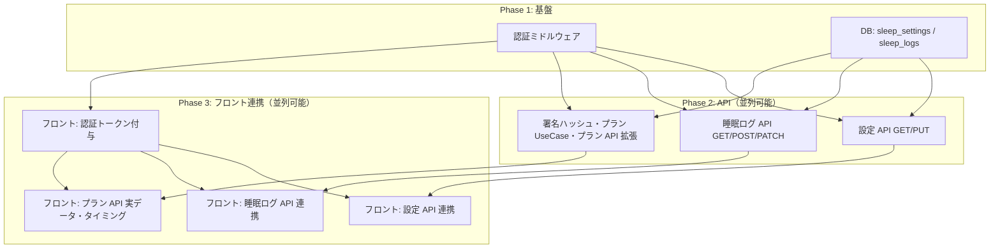

# 実装計画（バックエンド設計に基づく）

`docs/backend-design.md` に沿った実装を、**並列で進めやすい単位**に分解する。依存関係を明示し、複数人で同時に着手できるようにする。

---

## 依存関係の概要

- **Phase 1** が終われば、**Phase 2** の 3 本（設定 API・ログ API・プラン周り）は並列で実装可能。
- **Phase 2** の各 API が終われば、**Phase 3** の対応するフロント連携を並列で実装可能。

---

## Phase 1: 基盤

### 1.1 認証ミドルウェア

| 項目 | 内容 |
|------|------|
| 目的 | 全 API でトークン検証し、`user_id` を確定する。 |
| 成果物 | ミドルウェア or 依存性: リクエストから Authorization を読み、検証して `user_id` をコンテキストに載せる。未認証は 401。 |
| 参照 | backend-design.md §2 |
| 並列 | 1.2 と並行可能（担当分け）。 |

### 1.2 DB: sleep_settings と sleep_logs

| 項目 | 内容 |
|------|------|
| 目的 | 睡眠設定・睡眠ログ用テーブルを用意する。 |
| 成果物 | migration: `sleep_settings`（user_id, 起床・睡眠時間, ics_url, オーバーライド等）, `sleep_logs`（user_id, date, score, mood 等）。既存の users / sleep_plan_cache はそのまま。 |
| 参照 | backend-design.md §7.2, §7.3, §7.5 ER 図 |
| 並列 | 1.1 と並行可能。 |

---

## Phase 2: API（並列可能）

### 2.1 設定 API（GET / PUT）

| 項目 | 内容 |
|------|------|
| 目的 | 睡眠設定の取得・保存を API で提供する。 |
| 成果物 | `GET /api/v1/settings`, `PUT /api/v1/settings`。認証必須。Body は起床・睡眠時間, ics_url, レジリエンス, ミッション, 準備時間, todayOverride 等。 |
| 依存 | 1.1, 1.2 |
| 参照 | backend-design.md §4.1, §7.2 |
| 並列 | 2.2, 2.3 と並行可能。 |

### 2.2 睡眠ログ API（GET / POST / PATCH）

| 項目 | 内容 |
|------|------|
| 目的 | 睡眠ログの一覧取得・登録・気分更新を API で提供する。 |
| 成果物 | `GET /api/v1/sleep-logs?limit=7`, `POST /api/v1/sleep-logs`, `PATCH /api/v1/sleep-logs/:id`（mood 等）。認証必須。 |
| 依存 | 1.1, 1.2 |
| 参照 | backend-design.md §4.2, §7.3 |
| 並列 | 2.1, 2.3 と並行可能。 |

### 2.3 署名ハッシュ・プラン UseCase・プラン API 拡張

| 項目 | 内容 |
|------|------|
| 目的 | リクエストに todayOverride を含め、署名に含める。Cache Miss 時は AI で週間プラン生成。 |
| 成果物 | ① 入力（設定・ログ・カレンダー・**todayOverride**）の正規化と署名ハッシュ生成。② GetOrCreatePlan UseCase: force 対応、Cache Hit/Miss、AI 呼び出し。③ `POST /api/v1/sleep-plans` の Body に todayOverride、クエリに `force`。 |
| 依存 | 1.1, 1.2（既存 sleep_plan_cache を利用） |
| 参照 | backend-design.md §4, §4.3, §5, §6, §8 |
| 並列 | 2.1, 2.2 と並行可能。 |

---

## Phase 3: フロント連携（並列可能）

### 3.1 フロント: 認証トークン付与

| 項目 | 内容 |
|------|------|
| 目的 | 各 API 呼び出しに認証トークンを付与する。 |
| 成果物 | 共通 HTTP クライアント or インターセプターで Authorization ヘッダーを付与。トークンは Supabase Auth 等から取得・更新。 |
| 依存 | 1.1（バックエンドがトークン検証できる状態） |
| 参照 | backend-design.md §2, §9 |
| 並列 | 2.x 完了後、3.2〜3.4 と並行可能。 |

### 3.2 フロント: 設定 API 連携

| 項目 | 内容 |
|------|------|
| 目的 | 設定画面で GET/PUT 設定 API を使い、バックエンドをソースにする。 |
| 成果物 | 設定画面表示時に GET /api/v1/settings で取得してフォームに反映。保存時に PUT で送信。Zustand は取得結果で更新。 |
| 依存 | 2.1, 3.1 |
| 参照 | backend-design.md §4.1, §9 |
| 並列 | 3.3, 3.4 と並行可能。 |

### 3.3 フロント: 睡眠ログ API 連携

| 項目 | 内容 |
|------|------|
| 目的 | 睡眠ログの取得・登録・気分更新をバックエンド API で行う。 |
| 成果物 | ログ一覧は GET /api/v1/sleep-logs で取得。就寝終了時に POST、朝の振り返りで PATCH。Zustand は API 結果で更新。モック・ローカル初期値を廃止。 |
| 依存 | 2.2, 3.1 |
| 参照 | backend-design.md §4.2, §9 |
| 並列 | 3.2, 3.4 と並行可能。 |

### 3.4 フロント: プラン API 実データ・タイミング

| 項目 | 内容 |
|------|------|
| 目的 | プラン取得を実 API にし、リクエストに実データ（カレンダー・ログ・設定・todayOverride）と取得タイミング制御を入れる。 |
| 成果物 | ① SleepPlanRequest に todayOverride を追加。② fetchPlan で設定・ログ・icsUrl から calendarEvents を組み立て、実 Body で POST。③ lastFetchedDate を保持し、§4.0 のタイミング（日付跨ぎで再取得、スロットル、force）を実装。④ プルで更新で force=true。 |
| 依存 | 2.3, 3.1（設定・ログは 3.2/3.3 があれば API から取得可能；無くてもローカルストアから組み立ては可能） |
| 参照 | backend-design.md §4.0, §6, §9 |
| 並列 | 3.2, 3.3 と並行可能（3.2/3.3 未完了時はローカルストアで Body 組み立て）。 |

---

## 並列実装の進め方

| 担当例 | Phase 1 後 | Phase 2 後 |
|--------|------------|------------|
| 担当A | 2.1 設定 API | 3.2 設定 API 連携 |
| 担当B | 2.2 睡眠ログ API | 3.3 睡眠ログ API 連携 |
| 担当C | 2.3 プラン・署名・AI | 3.4 プラン API 実データ・タイミング |

- Phase 1 は 1.1 と 1.2 を並行で進める。
- Phase 2 は 2.1 / 2.2 / 2.3 を並行で進める。
- Phase 3 は 3.2 / 3.3 / 3.4 を並行で進める（3.1 は先行 or 並行で完了させる）。

---

## チェックリスト（Issue 対応用）

- [ ] **1.1** 認証ミドルウェア（トークン検証・user_id 注入・401）
- [ ] **1.2** DB: sleep_settings / sleep_logs の migration
- [ ] **2.1** 設定 API GET/PUT
- [ ] **2.2** 睡眠ログ API GET/POST/PATCH
- [ ] **2.3** 署名に todayOverride 含める・プラン UseCase・プラン API 拡張（force, todayOverride）
- [ ] **3.1** フロント: 認証トークン付与
- [ ] **3.2** フロント: 設定 API 連携
- [ ] **3.3** フロント: 睡眠ログ API 連携
- [ ] **3.4** フロント: プラン API 実データ・タイミング（lastFetchedDate, 日付跨ぎ, force）
