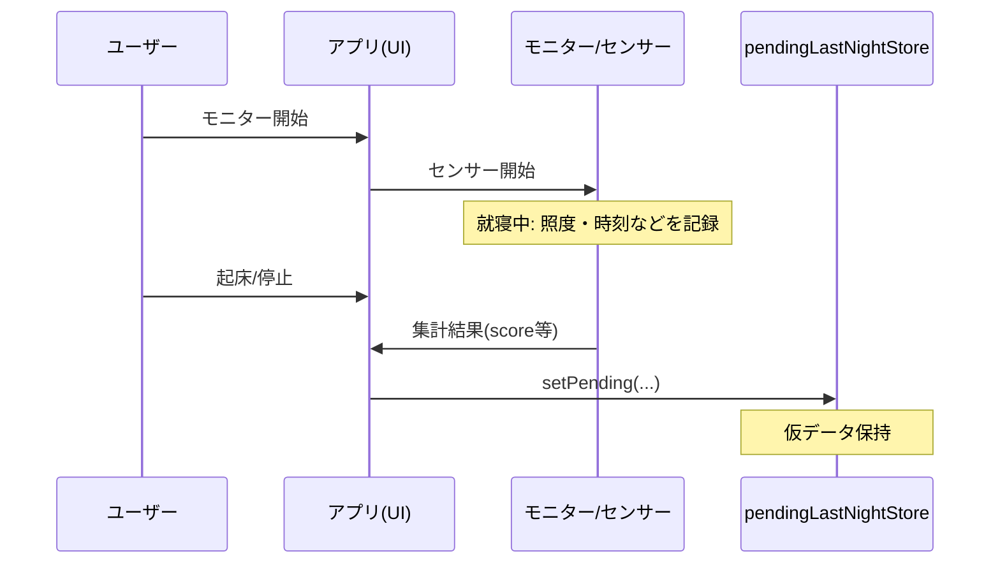
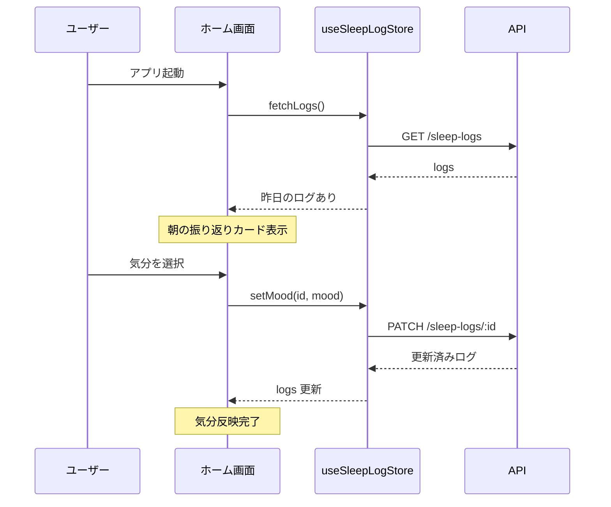
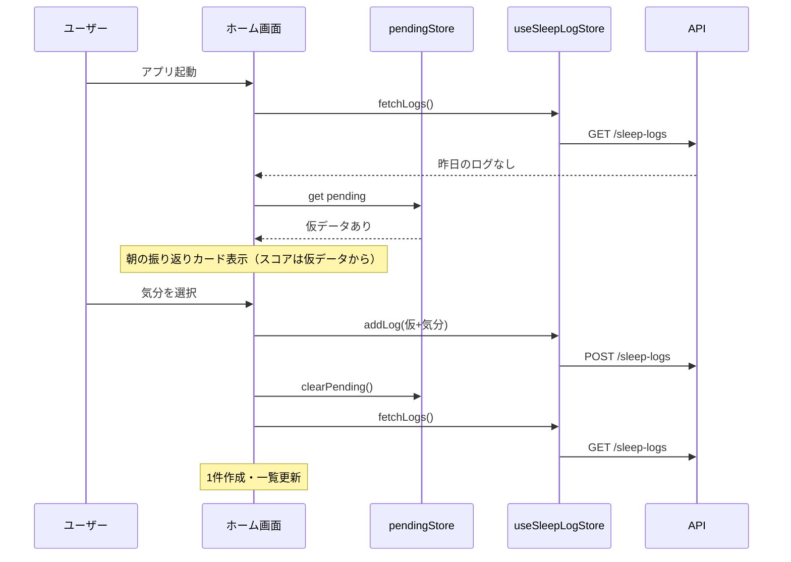
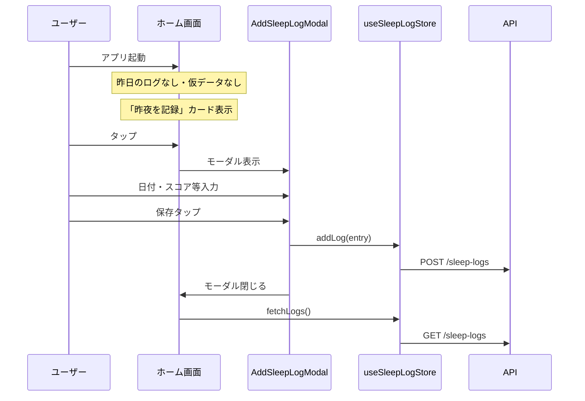

# 朝の振り返りと睡眠ログ保存のシーケンス・ビジネスロジック

## 1. 前提の整理

- **昨夜を記録**（手動フォーム）と **朝の振り返りカード** は別物。
- **朝の振り返り**でユーザーが気分を選んだタイミングで、**昨夜の1件のログを確定して保存する**（自動保存）。
- センサー情報（照度）・アラーム情報（起床時刻など）は **ユーザーが入力するのではなくアプリが記録する**。ユーザーが朝に入力するのは **気分（mood）** など最小限とする。

---

## 2. データの出どころ

| データ | 誰が記録するか | 備考 |
|--------|----------------|------|
| 記録日（date） | アプリ | 昨夜 = 今日の前日。アプリが決定。 |
| スコア・ペナルティ・警告 | アプリ | 就寝前のモニター（照度・使用状況など）から算出。未使用なら未設定 or デフォルト。 |
| 就寝予定時刻 | アプリ | 設定 or オーバーライドから取得。 |
| 起床・アラーム情報 | アプリ（将来） | アラーム停止時刻などを記録。 |
| **気分（mood）** | **ユーザー** | 朝の振り返りカードで選択。 |

---

## 3. シーケンス図

### 3.1 就寝前：モニターで仮データをセット



### 3.2 起床後：朝の振り返り（昨日のログが既にある場合）



### 3.3 起床後：朝の振り返り（ログなし・仮データあり → 気分選択で自動保存）



### 3.4 起床後：昨夜を記録（ログも仮データもなし → 手動フォーム）



### 3.5 フロー整理（テキスト）

```
[就寝前]
  ユーザー: モニター開始（照度センサー等）
  アプリ:   バックグラウンドで照度・時間帯を記録
            → 集計結果（スコア・ペナルティ・警告）を pendingLastNightStore に保持

[起床後]
  ユーザー: アプリを開く
  アプリ:   「昨日のログ」が既にあるか確認
            ├─ ある → 朝の振り返りカードを表示（既存ログのスコア＋気分）
            │          気分選択 → PATCH で mood だけ更新
            │
            └─ ない → アプリが持つ「昨夜分の仮データ」があるか確認
                      ├─ ある → 朝の振り返りカードを表示（仮データのスコア＋気分選択待ち）
                      │          気分選択 → POST で 1 件作成（仮データ＋気分）→ 仮データクリア
                      │
                      └─ ない → 「昨夜を記録」カードを表示（手動で日付・スコア入力）
                                タップでフォーム → POST で 1 件作成
```

---

## 4. ビジネスロジック（簡潔）

1. **朝の振り返りカードを出す条件**
   - 朝の時間帯（または開発時は常に）かつ、
   - **「昨日のログが既にある」** または **「昨日のログはないが、アプリが昨夜分の仮データを持っている」**。

2. **気分を選んだときの動作**
   - **昨日のログが既にある** → そのログの mood を PATCH で更新。
   - **昨日のログがなく、仮データがある** → 仮データ＋選択した mood で **POST して 1 件作成**し、仮データをクリア。
   - （昨日のログも仮データもない場合は、朝の振り返りカードは出さず「昨夜を記録」のみ。）

3. **「昨夜を記録」カード**
   - モニターを使わなかった日や、仮データが無いときの **手動フォールバック**。日付・スコア等をユーザーが入力して POST。

4. **アプリが記録する「昨夜分の仮データ」**
   - 就寝前モニター終了時（または翌朝アプリ起動時）に、集計結果を「昨日の date」で 1 件分保持。
   - 中身: `date`, `score`, `usagePenalty`, `environmentPenalty`, `phase1Warning`, `phase2Warning`, `lightExceeded`, `noiseExceeded`, `scheduledSleepTime` など（mood は null）。
   - 朝の振り返りで気分が選ばれたら、この仮データ＋mood で API に POST。

---

## 5. 実装の対応関係（済）

| 項目 | 対応 |
|------|------|
| 仮データの保持 | `usePendingLastNightStore`（`pendingLastNightStore.ts`）に「未保存の昨夜分」を保持。モニター終了時 or 就寝フローで `setPending(...)` を呼ぶ。 |
| 朝の振り返りで「ログなし＋仮データあり」 | カード表示時は仮データのスコアを表示。気分選択で `addLog(仮データ + mood)` → 成功したら `clearPending()` と `fetchLogs()`。 |
| 朝の振り返りで「ログあり」 | `setMood(logId, mood)` で PATCH。 |
| 昨夜を記録 | 仮データが無いときの手動用。`needRecordLastNight` のときだけ「昨夜を記録」カードを表示し、フォームで POST。 |

この流れで、「朝の振り返りで選んだら自動的に記録が保存される」かつ「センサー等はアプリが記録し、ユーザー入力は気分中心」にできる。

### モニター側の接続（実装済み）

照度センサー画面で「バックグラウンド計測停止」を押すと、`useLightSensor` の `stopBackgroundTask` 内で以下を実行する:

1. バックグラウンド中に蓄積した照度（`nightReadings`）を集計
2. 平均照度からスコア・`lightExceeded` を算出
3. 設定から就寝予定時刻を取得
4. `usePendingLastNightStore.getState().setPending({ date: 昨日, score, ... })` を呼ぶ

これにより、翌朝ホームで「朝の振り返り」カードにモニターのスコアが表示され、気分を選ぶと自動で API に保存される。
