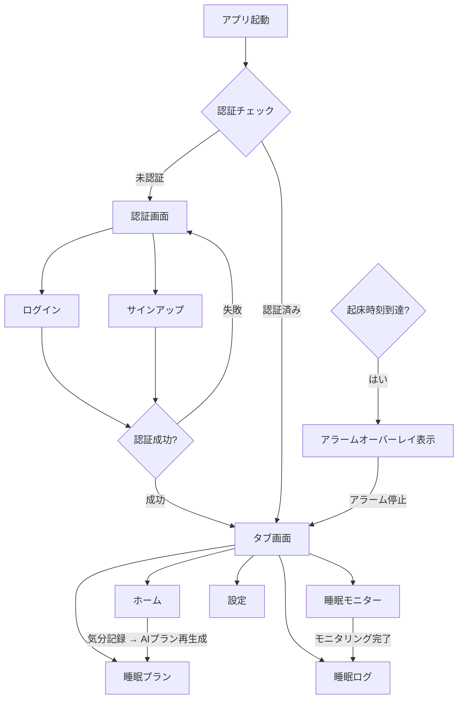
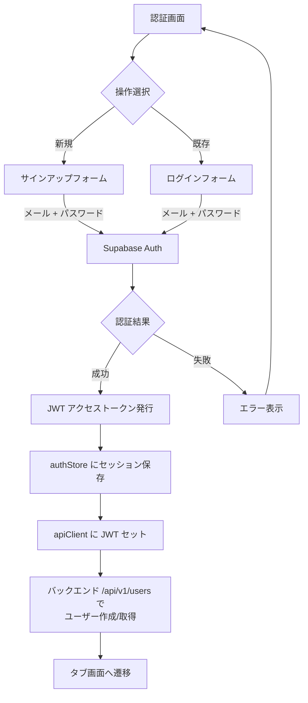
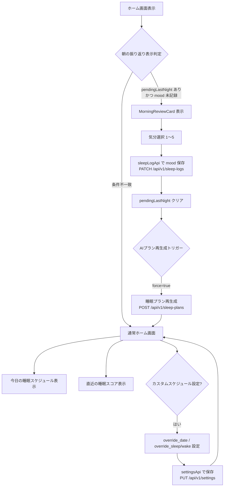
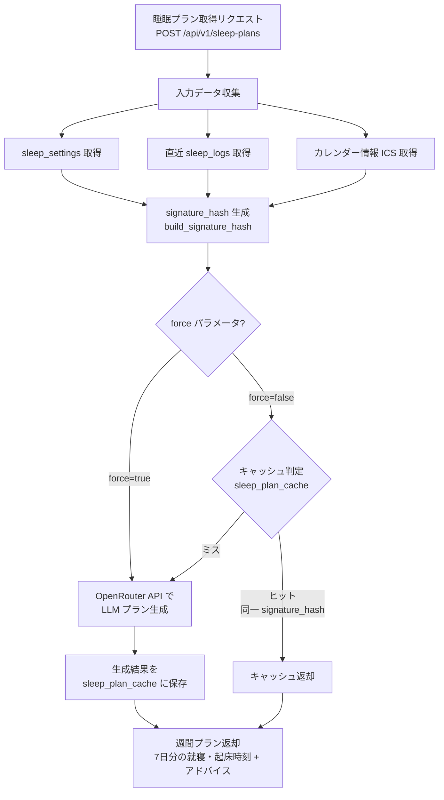
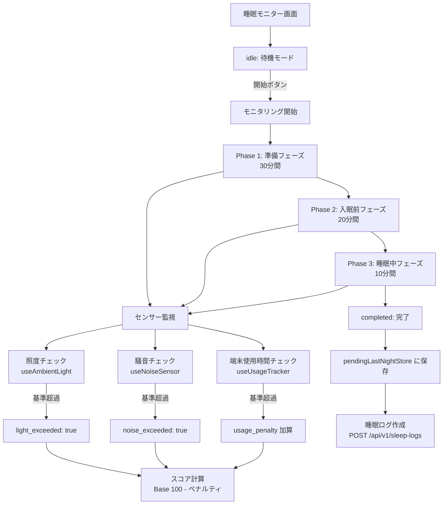
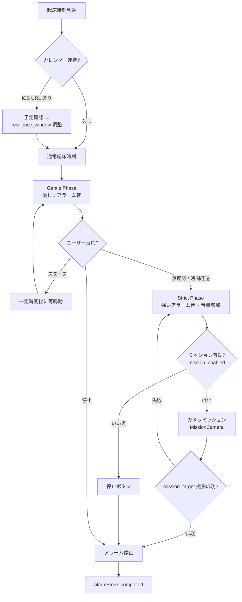

# SleepSupportApp フローチャート

## 1. アプリ全体フロー



## 2. 認証フロー



## 3. ホーム画面フロー



## 4. 睡眠プラン生成フロー



## 5. 睡眠モニターフロー



## 6. アラームフロー



## 7. データフロー（システム間連携）

```mermaid
flowchart LR
    subgraph Device[Android デバイス]
        FE[React Native<br/>Expo SDK 54]
        SENSOR[デバイスセンサー<br/>照度 / 騒音 / カメラ]
        STORE[Zustand Stores<br/>auth / settings / monitor<br/>log / plan / alarm]
    end

    subgraph External[外部サービス]
        SUPA[Supabase Auth<br/>JWT 発行・検証]
        GCAL[Google Calendar<br/>ICS フィード]
        LLM[OpenRouter API<br/>LLM 睡眠プラン生成]
    end

    subgraph Backend[FastAPI バックエンド]
        API[/api/v1/<br/>REST エンドポイント]
        UC[Application 層<br/>ユースケース]
        REPO[Infrastructure 層<br/>リポジトリ]
    end

    DB[(PostgreSQL<br/>users / sleep_logs<br/>settings / plan_cache)]

    FE <-->|authenticatedFetch<br/>+ JWT| API
    FE <-->|ログイン / サインアップ| SUPA
    FE -->|ICS 取得| GCAL
    SENSOR -->|環境データ| STORE
    STORE <--> FE

    API --> UC
    UC --> REPO
    REPO <--> DB
    UC -->|プラン生成| LLM
    API -->|JWT 検証| SUPA
```
