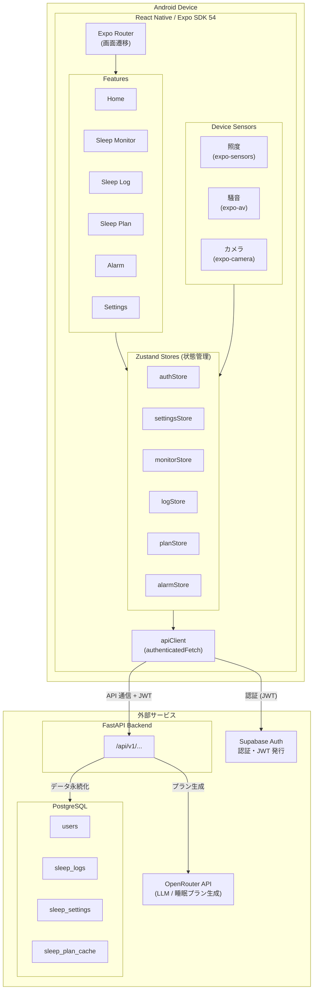

# システム構成図

```mermaid
graph TD
    subgraph Android["Android Device"]
        subgraph ExpoApp["React Native / Expo SDK 54"]
            Router["Expo Router<br/>(画面遷移)"]

            subgraph Features["Features"]
                Home["Home"]
                Monitor["Sleep Monitor"]
                Log["Sleep Log"]
                Plan["Sleep Plan"]
                Alarm["Alarm"]
                Settings["Settings"]
            end

            subgraph Stores["Zustand Stores (状態管理)"]
                AuthStore["authStore"]
                SettingsStore["settingsStore"]
                MonitorStore["monitorStore"]
                LogStore["logStore"]
                PlanStore["planStore"]
                AlarmStore["alarmStore"]
            end

            subgraph Sensors["Device Sensors"]
                Light["照度<br/>(expo-sensors)"]
                Noise["騒音<br/>(expo-av)"]
                Camera["カメラ<br/>(expo-camera)"]
            end

            ApiClient["apiClient<br/>(authenticatedFetch)"]
        end
    end

    subgraph External["外部サービス"]
        Supabase["Supabase Auth<br/>認証・JWT 発行"]

        subgraph Backend["FastAPI Backend"]
            API["/api/v1/..."]
        end

        subgraph DB["PostgreSQL"]
            Users["users"]
            SleepLogs["sleep_logs"]
            SleepSettings["sleep_settings"]
            PlanCache["sleep_plan_cache"]
        end

        OpenRouter["OpenRouter API<br/>(LLM / 睡眠プラン生成)"]
    end

    Router --> Features
    Features --> Stores
    Stores --> ApiClient
    Sensors --> Stores

    ApiClient -- "認証 (JWT)" --> Supabase
    ApiClient -- "API 通信 + JWT" --> API
    API -- "データ永続化" --> DB
    API -- "プラン生成" --> OpenRouter
```
